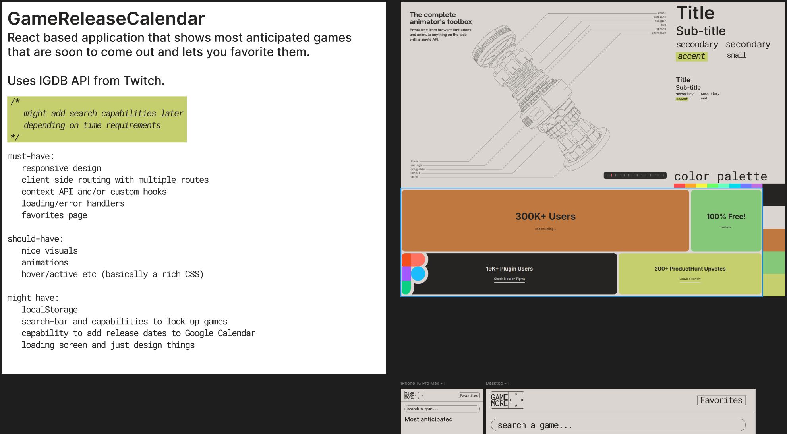

# GameMore - _Video game web-app_

---

_This project is under development. Design is not yet complete._


## Description

---

**Game Release Explorer** is a web application built with **React** and **TypeScript** that helps gamers discover
upcoming video game releases. The app integrates with the **IGDB API** to provide up-to-date information on new and
anticipated games. Users can search for titles, view detailed game information, and curate a personalized
list of favorites for easy access to the games they’re most excited about.

## Features

---

```
must-have:
    homepage with most anticipated game releases
    searchbar
    favorites page with user hand picked games
    detailed page for each video game

should-have:
    top rated games
    capability to add release dates to Google Calendar
    animations

could-have:
    about and contact pages
    ability to leave feedback for devs

```

## Design

---

I'm going for a minimalistic design that I have been doing for some of my other projects. Inspiration for the
features came from the [IGDB](https://www.igdb.com/) website. Color palette inspiration:
[AnimeJS](https://animejs.com/) and [Realtime Colors](https://www.realtimecolors.com/).
Design is done in [Figma](https://www.figma.com/).




### Color palette:


## Assets/Inspiration/References

---

[](https://api-docs.igdb.com/)
[](https://www.figma.com/)
[](https://animejs.com/)
[](https://www.realtimecolors.com/)
